# Bonsai Ticket Processing System

## What This Document Covers

Bonsai uses AI agents to do software development work. A human creates a ticket describing what needs to be built or fixed, and a team of AI agents researches, plans, and implements the solution. Humans stay in control at every critical decision point.

This document explains the full lifecycle of a ticket: how it moves through stages, what artifacts accumulate along the way, where humans must approve before work continues, and how the automation runs.

---

## The Big Picture

A ticket moves through four stages. At each stage, AI agents do the heavy lifting while humans make the key decisions.

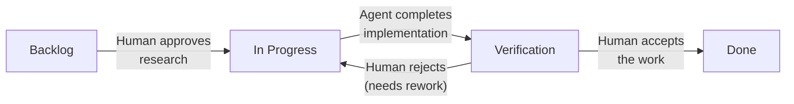

**Backlog** — The ticket exists but work hasn't started. An AI researcher is analyzing it.
**In Progress** — A human approved the research. Agents are planning and building.
**Verification** — The code is written. A human reviews whether it's correct.
**Done** — The work is accepted and complete.

---

## The Full Lifecycle

This diagram shows every step a ticket goes through, including who does what and what artifacts are created at each point.

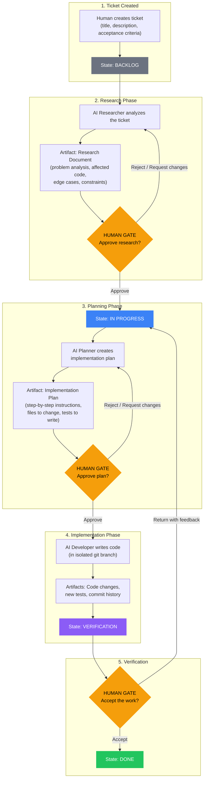

---

## Ticket Status Over Time

A ticket's status tells you where it is in the process. Here's what each status means in practice:

| Status | What's Happening | Who's Active | Duration |
|--------|-----------------|--------------|----------|
| **Backlog** | AI researcher is studying the problem. Analyzing code, identifying edge cases, writing a research document. | AI Researcher | Minutes |
| **In Progress** | Two sub-phases: (1) AI planner writes a step-by-step implementation plan, then (2) AI developer writes the actual code. Each sub-phase requires human approval before advancing. | AI Planner, then AI Developer | Minutes to hours |
| **Verification** | Code is written and committed. Waiting for a human to review the changes and either accept or send back for rework. | Human reviewer | Depends on human |
| **Done** | Work accepted. Ticket is complete. | Nobody | Terminal state |

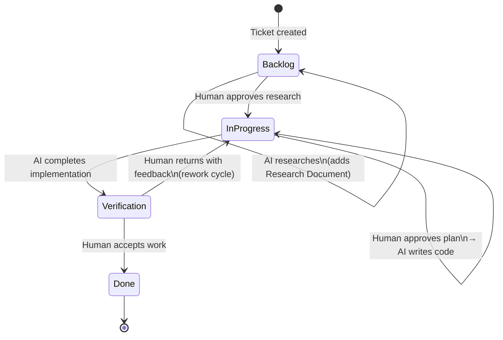

---

## Artifacts That Accumulate on a Ticket

As a ticket moves through the system, it builds up a collection of documents, comments, and code changes. These artifacts provide a complete paper trail of every decision.

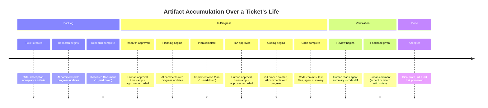

### Artifact Details

**Research Document**
Written by the AI researcher. Contains: problem summary, current state of the codebase, affected files and functions, edge cases, constraints, open questions, and a recommended approach. Stored in the database with version tracking — if the researcher revises it, the version number increments.

**Implementation Plan**
Written by the AI planner after research is approved. Contains: step-by-step instructions for what to change, which files to modify, what tests to write, and how to verify the changes work. Also version-tracked.

**Comments**
A running conversation thread on the ticket. Both humans and AI agents can post comments. Agent comments are visually distinguished from human comments. Comments include timestamps, author identity, and optional attachments.

**Code Changes**
The AI developer works in an isolated git branch (`ticket/{ticketId}`) inside a separate worktree directory. This prevents interference between agents working on different tickets simultaneously. Changes include new files, modified files, and test files.

---

## Human Gatekeeping Steps

Humans control three critical decision points. No automation can bypass these gates.

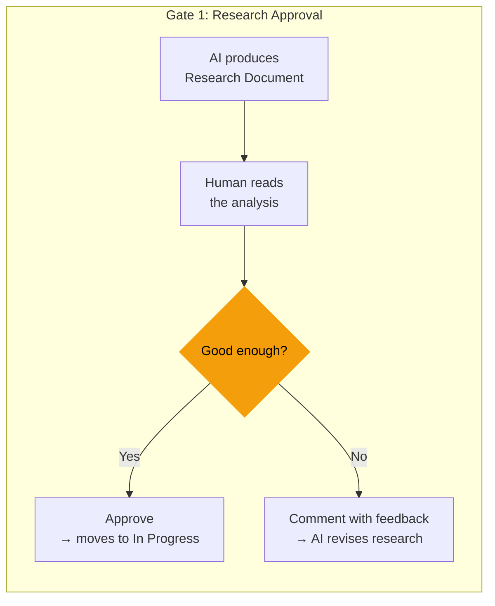

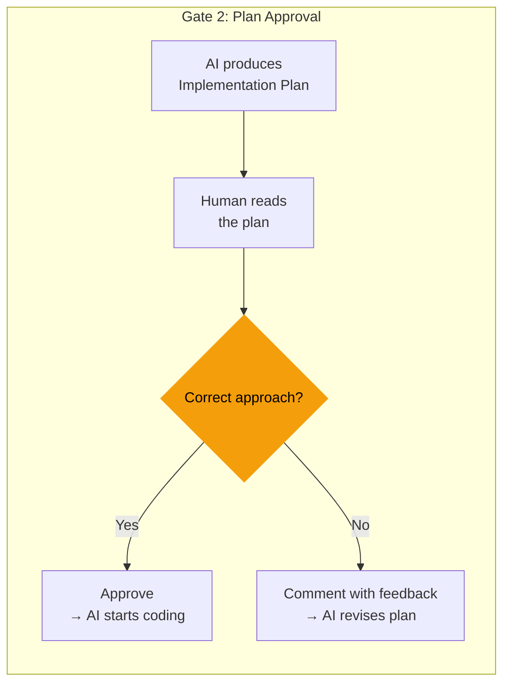

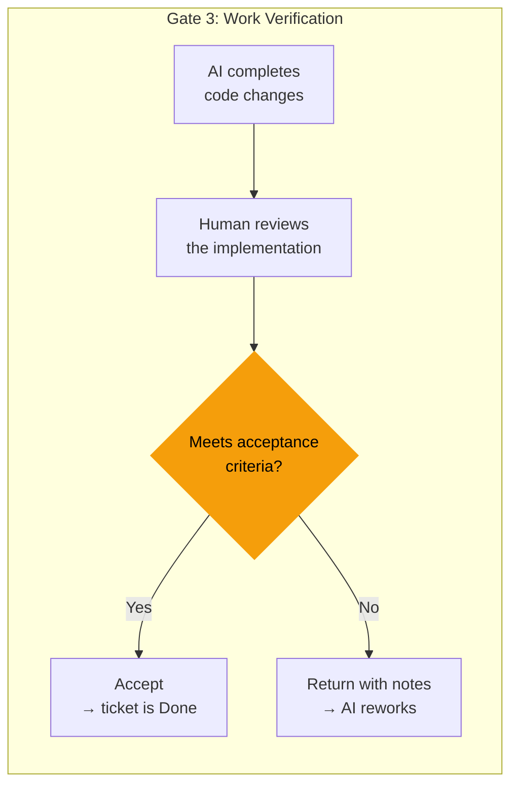

### Why Three Gates?

- **Gate 1 (Research)** ensures the AI understood the problem correctly before anyone starts planning a solution. Catching a misunderstanding here is cheap. Catching it after code is written is expensive.

- **Gate 2 (Plan)** ensures the implementation approach makes sense before code is written. A human can redirect the AI to a better strategy, avoid unnecessary complexity, or flag risks.

- **Gate 3 (Verification)** is the final quality check. The human confirms the code actually works, meets the acceptance criteria, and doesn't introduce problems. If it falls short, the ticket goes back to In Progress with specific feedback.

---

## How the Automation Is Triggered and Maintained

There are two mechanisms that trigger AI agents to work on tickets:

### Mechanism 1: Immediate Dispatch (Human-Triggered)

When a human takes certain actions, an AI agent is dispatched immediately:

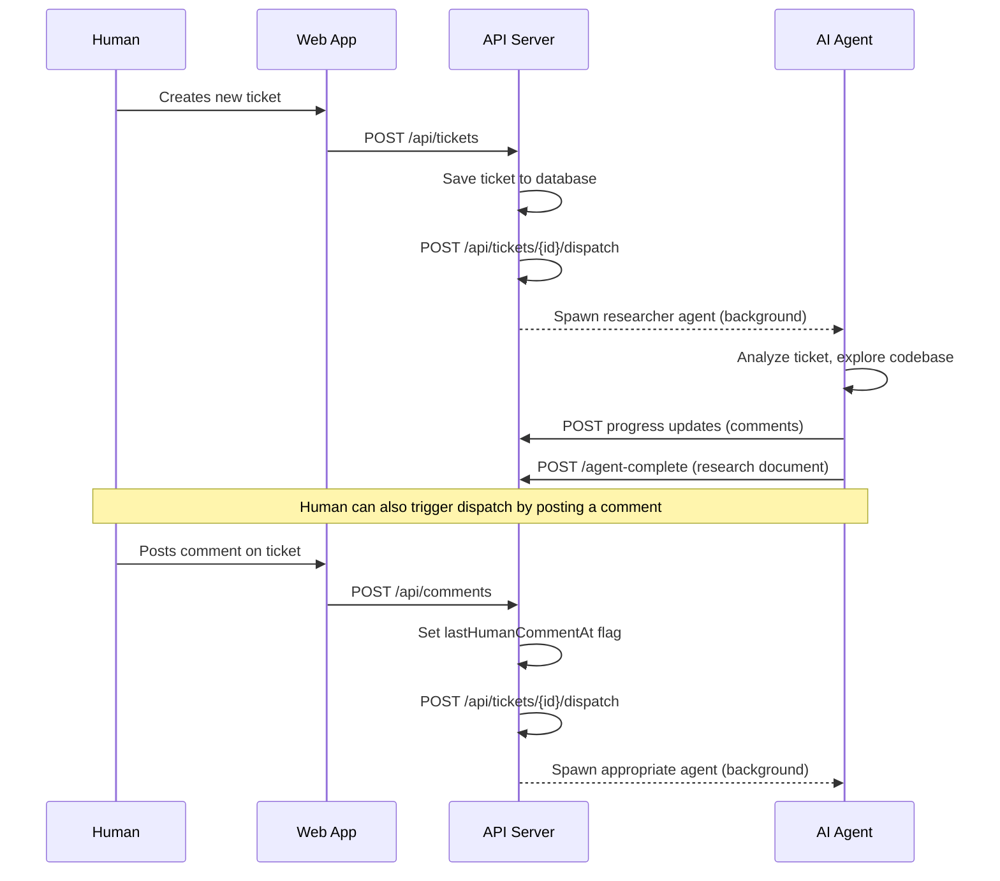

**Key detail:** When a human posts a comment on a ticket, two things happen: (1) an agent is dispatched immediately to respond, and (2) a `lastHumanCommentAt` flag is set on the ticket. This flag tells the automated scheduler that a human is waiting for a response, which gives this ticket higher priority.

### Mechanism 2: Heartbeat Scheduler (Automated)

A background process called the "heartbeat" runs every 5 minutes. It scans for tickets that need attention and dispatches agents to work on them.

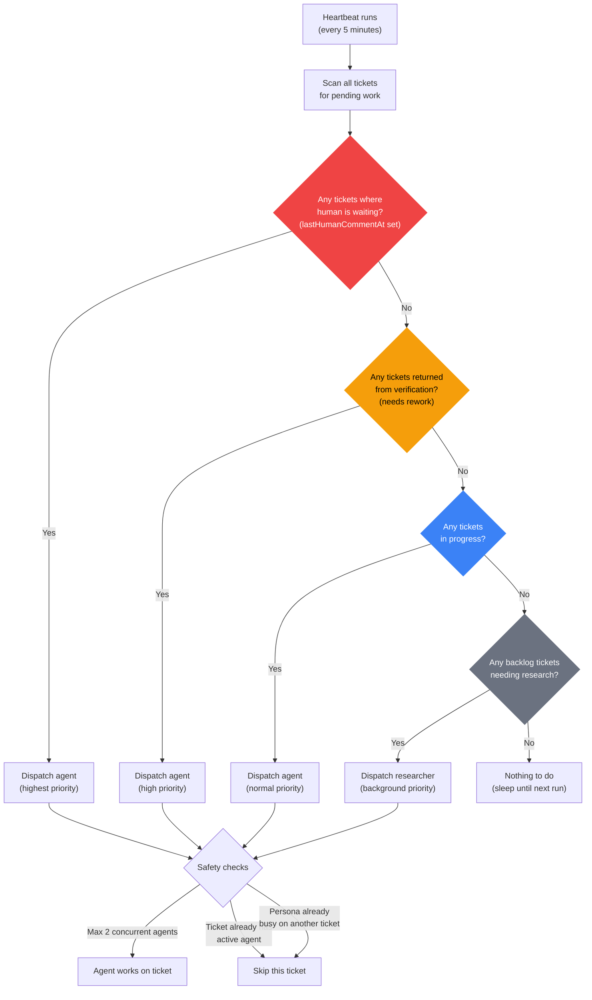

### Priority System

The heartbeat uses a priority system to decide which tickets get worked on first:

| Priority | Condition | Reasoning |
|----------|-----------|-----------|
| **Highest** | Human posted a comment | A person is waiting. Respond fast. |
| **High** | Returned from verification | Work was rejected. Fix it before starting new work. |
| **Normal** | In progress, plan approved | Active work that should continue. |
| **Low** | Backlog, needs research | New tickets that no one is waiting on yet. |

### Safety Mechanisms

The system has several safeguards to prevent chaos:

- **Activity lock:** When an agent starts working on a ticket, a timestamp is recorded. No other agent can pick up that ticket for 30 minutes. This prevents two agents from making conflicting changes to the same code.

- **Concurrency limit:** Maximum 2 agents can run at the same time. This prevents overloading the system.

- **Persona exclusivity:** Each AI persona (researcher, developer, etc.) can only work on one ticket at a time. If "Kira the developer" is already implementing ticket A, she won't be assigned ticket B until she finishes.

- **Isolated workspaces:** Each ticket's code changes happen in a separate git branch and worktree directory. Agent A's changes can't accidentally break Agent B's work.

---

## Which AI Role Does What

Different AI personas handle different phases of work. Each role has specific tools it's allowed to use:

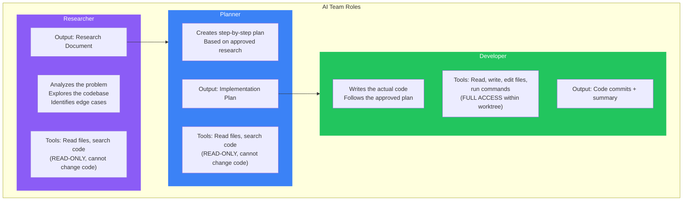

**Why read-only for researchers and planners?** These roles only need to understand the code, not change it. Restricting their tools prevents accidental modifications during the analysis and planning stages. Only the developer role — working from an approved plan, in an isolated branch — has permission to write code.

---

## End-to-End Example

Here's a concrete example of how a ticket flows from creation to completion:

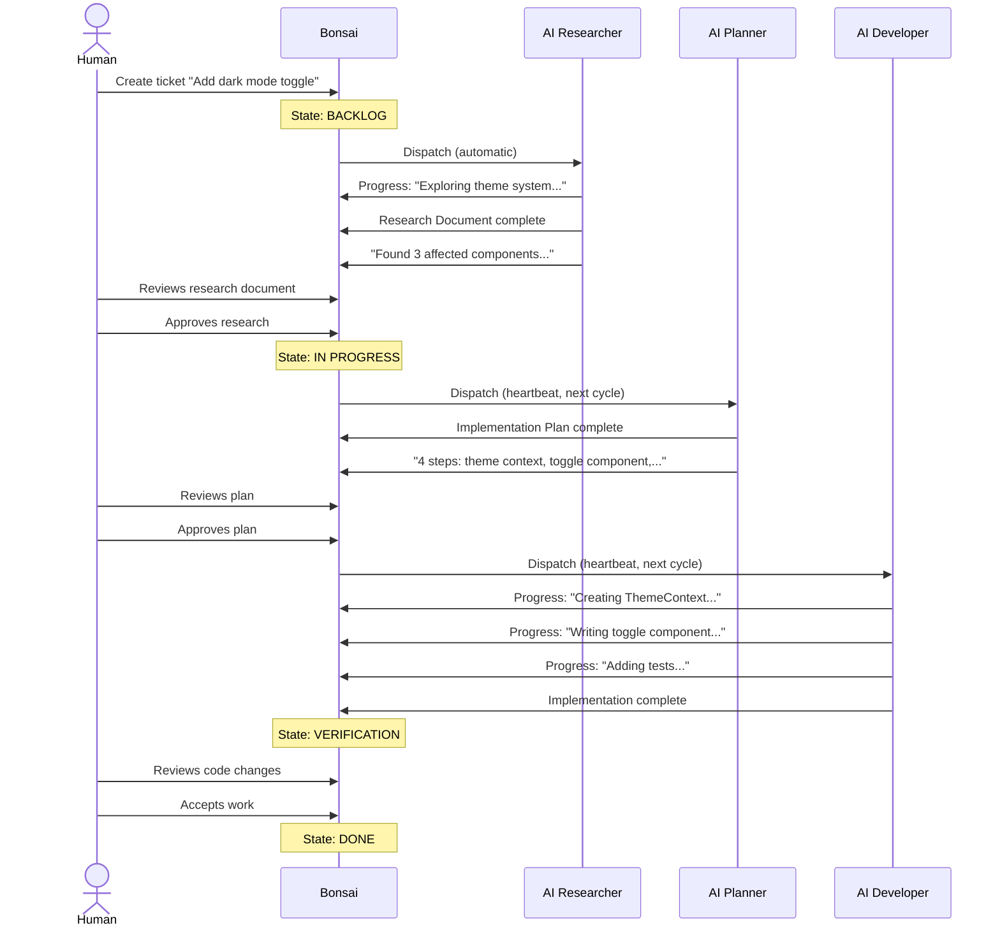

---

## Summary

| Concept | How It Works |
|---------|-------------|
| **Ticket stages** | Backlog → In Progress → Verification → Done |
| **AI work phases** | Research → Planning → Implementation (one at a time, in order) |
| **Human gates** | Three approval points: after research, after planning, after coding |
| **Artifacts** | Research document, implementation plan, comments, code commits |
| **Immediate triggers** | Ticket creation and human comments dispatch agents instantly |
| **Background automation** | Heartbeat scheduler runs every 5 minutes, picks up pending work |
| **Safety** | Activity locks, concurrency limits, persona exclusivity, isolated git branches |
| **Priority** | Human-waiting > rework > active work > new research |
